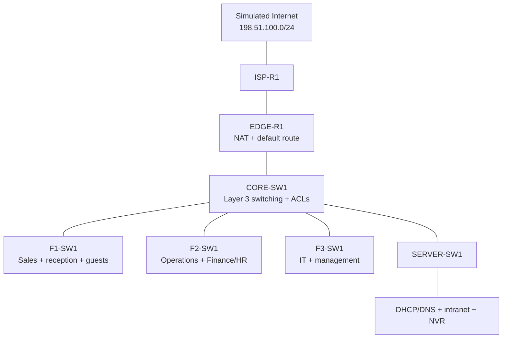

# Secure Three-Floor Office Network

## Project summary

This project designs and validates a segmented network for a fictional three-floor office with approximately 75 employees. The network separates business departments, infrastructure, voice, printers, cameras, and guest Wi-Fi while providing centralized DHCP/DNS, inter-VLAN routing, Internet access through PAT, and restricted access for untrusted devices.

The Packet Tracer file uses a small number of representative endpoints rather than drawing every employee device. The architecture and IP plan are sized so additional devices can be added without redesigning the network.

## Business requirements

- Provide wired connectivity for Sales, Operations, Finance/HR, IT, and office management.
- Isolate guest wireless clients from the internal network.
- Restrict cameras and IoT devices from initiating connections to employee networks.
- Centralize DHCP and DNS services.
- Provide internal name resolution for company services.
- Allow users to reach a simulated Internet through NAT/PAT.
- Create a dedicated management network for switches.
- Apply basic Layer 2 protections to user-facing switch ports.
- Make the network understandable and supportable by another technician.

## High-level topology

## Logical segmentation

| VLAN | Name | Subnet | Gateway | Purpose |
|---:|---|---|---|---|
| 10 | Management | `10.20.10.0/24` | `10.20.10.1` | Switch management |
| 20 | Sales | `10.20.20.0/24` | `10.20.20.1` | Sales users |
| 30 | Operations | `10.20.30.0/24` | `10.20.30.1` | Operations, reception, and office management |
| 40 | Finance-HR | `10.20.40.0/24` | `10.20.40.1` | Finance and HR users |
| 50 | IT | `10.20.50.0/24` | `10.20.50.1` | IT administrators and support workstations |
| 60 | Voice | `10.20.60.0/24` | `10.20.60.1` | IP phones and future voice services |
| 70 | Servers | `10.20.70.0/24` | `10.20.70.1` | Internal application and infrastructure servers |
| 80 | Printers | `10.20.80.0/24` | `10.20.80.1` | Network printers |
| 90 | Cameras-IoT | `10.20.90.0/24` | `10.20.90.1` | Cameras and restricted IoT devices |
| 100 | Guest-WiFi | `10.20.100.0/24` | `10.20.100.1` | Internet-only guest clients |
| 999 | Parking-Native | None | None | Unused ports and non-user native VLAN |

The full address inventory is in [`docs/IP_ADDRESSING_PLAN.md`](docs/IP_ADDRESSING_PLAN.md).

## Security controls

- Department and device separation using VLANs
- Guest ACL that allows DNS but blocks access to `10.20.0.0/16`
- Camera/IoT ACL that allows the NVR and DNS but blocks other internal networks
- Dedicated IT and switch-management networks
- SSH-only virtual terminal access restricted to the IT subnet
- Port security with sticky MAC learning on user ports
- PortFast and BPDU Guard on edge ports
- Unused ports assigned to VLAN 999 and administratively disabled
- Explicit trunk allowed-VLAN lists and unused native VLAN
- PAT at the edge router to hide internal addressing

## Core services

| Service | Address | Name |
|---|---|---|
| DNS and DHCP | `10.20.70.10` | `dns-dhcp.evanlab.local` |
| Intranet web server | `10.20.70.20` | `intranet.evanlab.local` |
| NVR / logging server | `10.20.70.30` | `nvr.evanlab.local` |
| Simulated public web server | `198.51.100.10` | `internet.test` |

## Implementation

1. Build and cable the topology using the physical port map.
2. Create VLANs and trunks on the core and access switches.
3. Enable Layer 3 switching and configure SVIs on `CORE-SW1`.
4. Configure DHCP relay to the centralized server.
5. Configure the edge and ISP routers, static routing, and PAT.
6. Configure DNS, DHCP, HTTP, endpoints, wireless, and static infrastructure addresses.
7. Apply guest, camera, management, and access-port security controls.
8. Validate addressing, routing, name resolution, NAT, and segmentation.

Detailed instructions are in [`docs/BUILD_GUIDE.md`](docs/BUILD_GUIDE.md), and paste-ready Cisco configurations are in [`configs/`](configs/).

## Validation evidence

Replace this section with your results after building the `.pkt` file.

| Test | Expected result | Actual result |
|---|---|---|
| Sales PC receives DHCP lease | `10.20.20.50+` with gateway and DNS | Passed |
| Finance PC resolves intranet name | Resolves to `10.20.70.20` | Passed |
| IT PC manages an access switch | SSH succeeds | Passed |
| Guest reaches internal server | Blocked by ACL | Passed |
| Guest reaches simulated Internet | Allowed through PAT | Passed |
| Camera reaches NVR | Allowed | Passed |
| Camera reaches employee VLAN | Blocked by ACL | Passed |

## Troubleshooting work

The repository includes controlled failure scenarios covering DHCP relay, VLAN trunking, DNS records, default gateways, and ACL placement. Recording the symptom, evidence, root cause, repair, and retest demonstrates troubleshooting—not merely configuration.

See [`docs/TROUBLESHOOTING_SCENARIOS.md`](docs/TROUBLESHOOTING_SCENARIOS.md).

## Design limitations and production improvements

This lab intentionally uses one core switch and one edge router so it remains practical in Packet Tracer. A production office should also consider:

- Redundant core switches, edge devices, uplinks, and power
- A stateful next-generation firewall instead of relying only on router ACLs
- Enterprise wireless controllers and 802.1X authentication
- Centralized AAA using RADIUS or TACACS+
- Dynamic routing when multiple sites or redundant paths are added
- Network monitoring, configuration backups, NetFlow, SNMPv3, and centralized syslog
- IPv6 addressing and security controls
- Formal high-availability and disaster-recovery requirements

Recognizing these limitations is part of the design rather than an attempt to present Packet Tracer as a complete production emulator.

## Skills demonstrated

`VLANs` · `802.1Q trunks` · `IPv4 subnetting` · `SVIs` · `inter-VLAN routing` · `DHCP relay` · `DNS` · `static routing` · `NAT/PAT` · `ACLs` · `port security` · `STP protections` · `SSH management` · `network validation` · `technical documentation`
